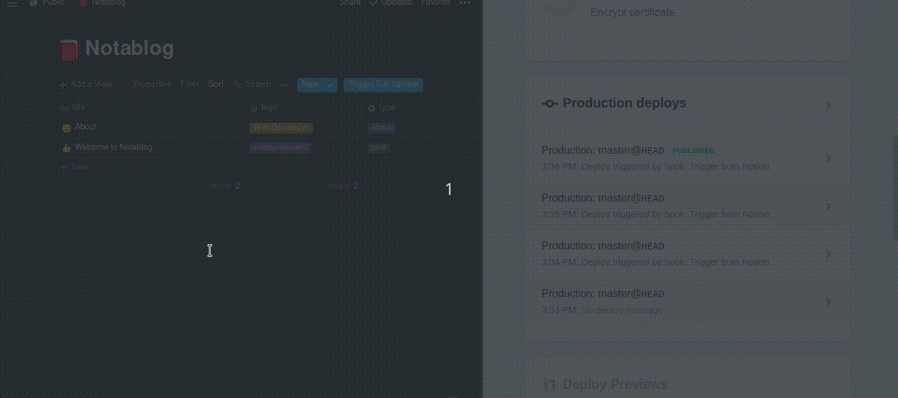

# Trigger Webhook from Notion

Trigger a webhook that activates on a POST request directly from a [Notion table](https://www.notion.so/b6fcf809ca5047b89f423948dce013a0?v=03ddc4d6130a47f8b68e74c9d0061de2).

Below is a demo where I can just click a button on a Notion table and trigger [Netlify](https://www.netlify.com)'s build webhook to update my blog built with [Notablog](https://github.com/dragonman225/notablog).



## How to Use

This is a **proof-of-concept**, so it requires a few changes in code to adapt to your need. They are simple, and I'll explain as clear as possible.

1. Open `src/extension.js`, replace the dummy `buildHookUrl` with your webhook URL.
  
   Any webhook should work, as long as the webhook can be triggered by an empty `POST` request (for example, Netlify's).
   
   ```javascript
   const buildHookUrl = 'https://Replace.this.string.with.your.webhook.URL'
   ```

2. (Optional) If you want the trigger button appear only on one table, open `manifest.json`, in `content_scripts.matches`, change `https://www.notion.so/*` to a table's URL.
  
   If you skip this step, you will see the trigger button **on every table**.
   
   ```javascript
   "content_scripts": [
     {
       "matches": [
         "https://www.notion.so/*" // Change this
       ],
       // ...
     }
   ]
   ```

3. Load this extension into your browser. Since this is an unpacked extension, it needs to be loaded in developer mode or debug mode.
  
   For **Google Chrome** or **Chromium-based**, follow the tutorial: https://developer.chrome.com/extensions/getstarted.
   
   For **Firefox**, follow the tutorial: https://developer.mozilla.org/en-US/docs/Mozilla/Add-ons/WebExtensions/Your_first_WebExtension#Installing.

4. Open a table in Notion to test it out!

## How it works

### Motivation

In my case, I want to trigger Netlify's webhook to rebuild my static blog when I update posts on Notion with a single click. The webhook needs to be triggered by an empty `POST` request, but I couldn't find a block in Notion that can do a `POST` request. In addition, I use a full-page table to manage my posts, so there's actually no way to insert other type of blocks unless I change the [Notablog](https://github.com/dragonman225/notablog)'s logic.

### The Extension

#### Prepare a trigger button

I think of HTML's `<form>`, where I can specify the HTTP method and in my case I just need to `POST` with an empty form. This is attractive to me because it doesn't need AJAX, which means easier to implement !

So, I write the following

```javascript
/** Prepare a button */
const button = document.createElement('DIV')
/** Give the button an id so we can check if it exists later */
button.setAttribute('id', BUTTON_ID)
button.setAttribute('style', 'margin-left: 10px; display: inline-flex')
/**
 * Use a dummy iframe to prevent redirect
 * @see https://stackoverflow.com/a/28060195
 */
button.innerHTML = `\
<iframe width="0" height="0" border="0" name="dummyframe" id="dummyframe" style="display: none;"></iframe>
<form action="${buildHookUrl}" method="post" target="dummyframe">
  <button style="font-size: 14px; color: white; height: 24px; background: rgb(46, 170, 220); border: none; border-radius: 3px;">Trigger Site Update</button>
</form>
`
```

Create a `<div>`, inside the `<div>` we have a `<form>`, then we have a `<button>` in the `<form>`. The `<form>` has `action` attribute set to the `buildHookUrl`, which is the webhook URL, and `method` attribute set to `post`.

This translates to: When we click the button, an empty form will be submit to the URL in `action` with `post` method. This is exactly what I want.

---

Wait! What's the `<iframe>` doing there?

Actually, the script works without the `<iframe>`, but in that case after we click the button, we will be redirected to the webhook URL. This behavior is a bit annoying, so I find a way to prevent it, see https://stackoverflow.com/a/28060195.

The `<iframe>` is not rendered, and the I set `target` attribute of `<form>` to the `<iframe>`'s `id`, so the redirect happens in the `<iframe>`, without effecting the main page.

#### Inject the button to the page

By default, the browser loads content scripts of an extension after a page is **loaded**. The "**loaded**" means HTML is loaded. This is OK for static web pages, but since Notion is an React app, the parent element we want to inject to **may not exist** when HTML is loaded, so we need additional techniques to handle it.

In the past, I used to use `DOMSubtreeModified` event to trigger my injection logic ([like this](https://github.com/dragonman225/AlbumArtTool/blob/dcac7a5e58838e80a279f710f7ac8e89da34c7b5/src/extension.js#L186)), but now this event seems to be completely removed from Firefox 68, so I have to find something new, which is the [`MutationObserver`](https://developer.mozilla.org/zh-TW/docs/Web/API/MutationObserver). 

```javascript
/**
 * Use MutationObserver API, DOMSubtreeModified event is deprecated.
 * @see https://developer.mozilla.org/zh-TW/docs/Web/API/MutationObserver
 */
const observer = new MutationObserver(function (mutations) {
  /** Try to hook up the button if not exist */
  let toolbar = document.querySelector('div.notion-scroller:nth-child(2) > div:nth-child(2) > div:nth-child(1) > div:nth-child(1) > div:nth-child(2)')
  let btn = document.getElementById(BUTTON_ID)
  /** btn doesn't exists && toolbar exists */
  if (!btn && toolbar) toolbar.appendChild(button)
});
const observerConfig = {
  attributes: true,
  childList: true,
  characterData: true,
  subtree: true
}
observer.observe(document, observerConfig)
```

The `MutationObserver` behaves the same as `DOMSubtreeModified` event, if I set `subtree: true` in the config object.

Note that here I target `document` in `observe()`, which seems to be inefficient. But since Notion's React app is bundled as an [IIFE](https://developer.mozilla.org/en-US/docs/Glossary/IIFE), which does not expose any variable that can be accessed from outside bundle, also we don't know how does the app execute. So listening to all mutations in `document` makes sure we don't lose any chance to detect if the page is ready for injection.
